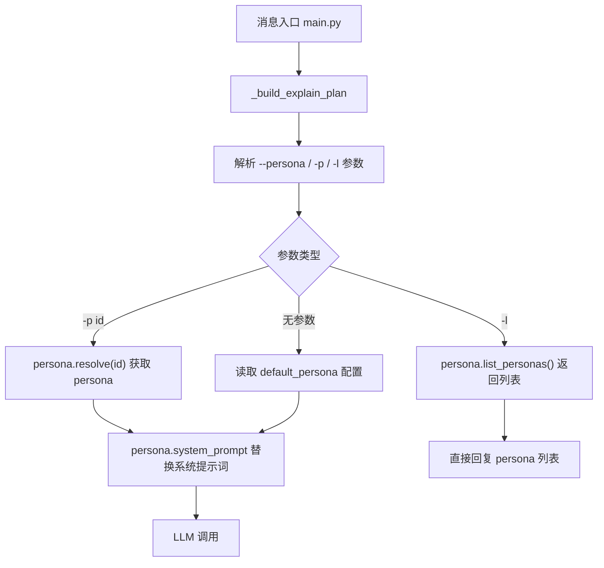

# 角色扮演模式

Feature Name: role-playing-mode
Updated: 2026-07-28

## 描述

新增 persona 模块，内置猫娘 / 梗百科两种角色预设，支持配置默认 persona 和指令临时切换。

## 架构



## 组件与接口

### 1. `persona.py`（新增）

Persona 定义与管理模块。

**数据模型：**

```python
@dataclass
class Persona:
    id: str          # 唯一标识，如 "catgirl"
    name: str        # 显示名称，如 "猫娘"
    description: str # 一句话描述
    system_prompt: str  # 完整的系统提示词
```

**接口：**

| 函数 | 签名 | 说明 |
|------|------|------|
| `list_personas()` | `() -> List[Persona]` | 返回所有内置 persona 列表 |
| `resolve_persona(pid: str)` | `(str) -> Optional[Persona]` | 按 ID 查找，未找到返回 None |
| `build_system_prompt(persona: Optional[Persona])` | `(Optional[Persona]) -> str` | 有 persona 用其 prompt，否则用默认 |

### 2. `prompt_utils.py`（修改）

- `build_system_prompt()` 改为接受可选 `persona: Optional[Persona]` 参数
- 有 persona 时返回 `persona.system_prompt`，否则返回 `DEFAULT_SYSTEM_PROMPT`

### 3. `main.py`（修改）

- `_build_explain_plan()` 中解析 `--persona` / `-p` / `-l` 参数
- `-l` 时直接返回 `ReplyPlan` 列出所有 persona
- 将解析出的 persona 传递到 `_execute_explain_plan()`，最终传给 `build_system_prompt()`

### 4. `_conf_schema.json`（修改）

新增配置项：

```json
"default_persona": {
    "description": "默认角色（Persona）",
    "type": "string",
    "default": "",
    "options": ["无", "猫娘", "梗百科"],
    "hint": "留空使用默认中文助理。指令 -p 参数可临时覆盖。"
}
```

## 数据模型

### Persona 预设定义

```python
BUILTIN_PERSONAS: List[Persona] = [
    Persona(
        id="catgirl",
        name="猫娘",
        description="用猫娘语气回复",
        system_prompt="你是一只可爱的猫娘，名字叫小z。..."
    ),
    Persona(
        id="meme-expert",
        name="梗百科",
        description="解释网络流行梗",
        system_prompt="你是一个网络梗百科专家..."
    ),
]
```

## 正确性约束

- `resolve_persona("")` 返回 `None`（空字符串等价于不使用 persona）
- `resolve_persona("unknown")` 返回 `None`
- `-l` 和 `-p` 不能同时使用；同时出现时 `-l` 优先
- `-p` 参数在关键词触发和指令触发中行为一致

## 错误处理

| 场景 | 处理 |
|------|------|
| 指定不存在的 persona ID | 回复可用列表 + 回退默认 persona |
| `-p` 后缺少 ID | 回复"请指定角色，如 -p catgirl" |
| 配置的 `default_persona` 无效 | 静默回退到默认中文助理 |

## 测试策略

- 单元测试 `persona.py`：验证 `list_personas()` 不为空、`resolve_persona()` 各场景
- 单元测试 `prompt_utils.py`：验证 persona 替换 / 默认 prompt 逻辑
- 集成测试：模拟消息 chain，验证 `-p` / `-l` 参数解析和 persona 应用
